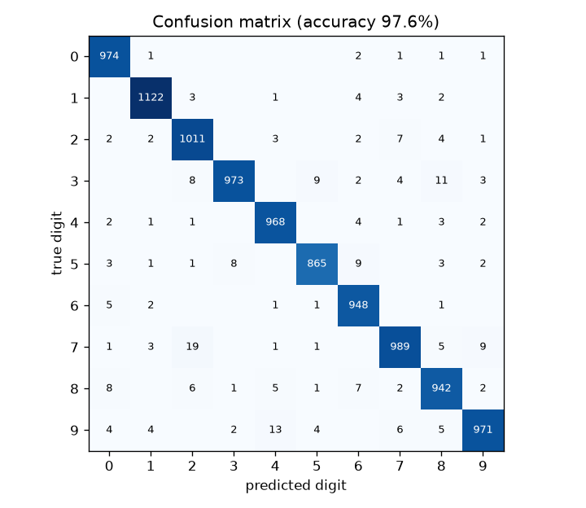
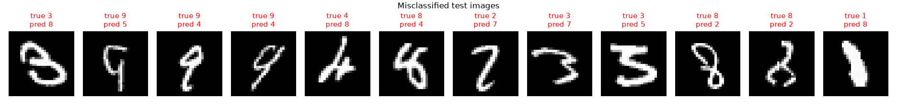
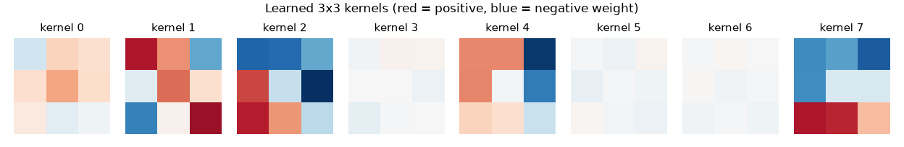
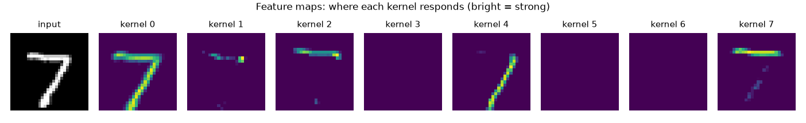

# Convolutional-Neural-Network

A Convolutional Neural Network built from scratch in NumPy for handwritten digit classification on MNIST. No PyTorch, no TensorFlow, just pure math.

## How to run

```bash
python mnist.py
```

## Results

Trained on all 60,000 MNIST training images for 5 epochs and evaluated on the 10,000 test images:

**Test accuracy: 97.6%**



The most common mistakes are 7 → 2, 9 → 4 and 3 → 8. Some examples of misclassified test images:



## The Kernels

The 8 learned 3×3 kernels of the convolutional layer. Several turned into edge detectors, for example kernels 2 and 7 respond to horizontal edges:



What each kernel responds to in one test digit. Kernel 7 lights up on the top bar of the 7, kernel 4 on the diagonal stroke. Kernels 3, 5 and 6 stayed inactive during training which is a typical case of the dying ReLU problem.



## Architecture

```
Input              (1, 28, 28)
Conv 1→8, 3×3      (8, 26, 26)
ReLU
MaxPool 2×2        (8, 13, 13)
Flatten            (1, 1352)
Dense 1352→10      (1, 10)
Softmax            (1, 10)
Cross-entropy loss
```

Training uses stochastic gradient descent, one image at a time, with a learning rate of 0.005.


